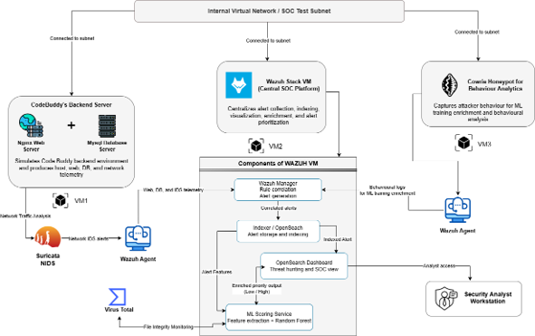
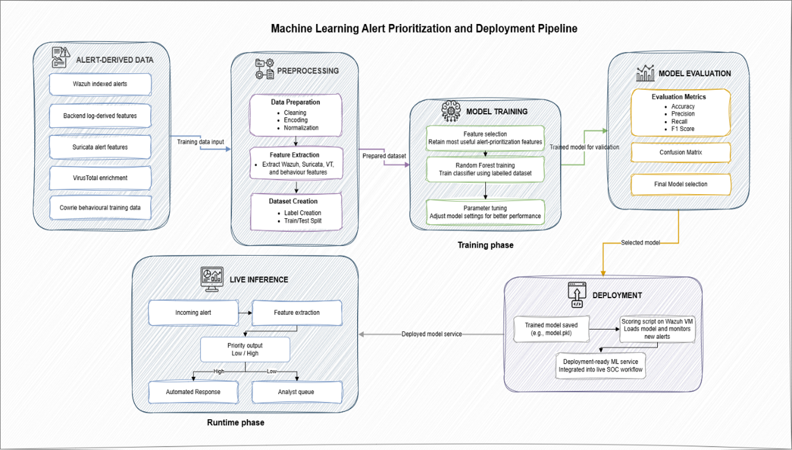

# AI-Enhanced SOC with ML-Based Threat Prioritization

An AI-enhanced Security Operations Center designed to improve security alert prioritization in an SME environment using machine learning, contextual security features, threat intelligence, campaign correlation, and controlled automated response.

---

## Overview

Traditional SIEM platforms can generate large volumes of security alerts, making it difficult for analysts to determine which events require immediate attention.

This project extends a Wazuh-based SOC with a machine learning prioritization layer that evaluates security alerts and classifies eligible events as **High** or **Low priority**.

The system combines:

- Wazuh security monitoring
- Suricata network intrusion detection
- Auditd host-level monitoring
- VirusTotal threat intelligence
- Random Forest-based alert prioritization
- MITRE ATT&CK contextual mapping
- Campaign correlation
- Controlled IP blocking
- Slack security notifications
- OpenSearch/Wazuh dashboard visualization

The machine learning layer does not replace Wazuh detection. Instead, it acts as an additional intelligence layer that helps analysts prioritize detected alerts using multiple contextual indicators.

---

## Problem Statement

SMEs may rely on security tools that generate large numbers of alerts without providing sufficient contextual prioritization.

This can create several operational challenges:

- Important alerts may be hidden among lower-value events.
- Analysts may spend unnecessary time reviewing repetitive alerts.
- Static severity levels may not reflect the full security context of an event.
- Security data from different monitoring sources may not be prioritized consistently.
- Delayed identification of important alerts can slow investigation and response.

The project addresses this problem by introducing a machine learning layer that evaluates multiple alert characteristics before assigning operational priority.

---

## Proposed Solution

The proposed system integrates machine learning with an open-source SOC architecture.

Security events are collected through Wazuh and supporting monitoring tools. Relevant alert information is transformed into a structured **21-feature input vector** and processed by a trained Random Forest classifier.

The model produces a probability score for each eligible alert.

A selected operational threshold is then used to classify the alert as:

- **HIGH** — requires greater analyst attention
- **LOW** — lower operational priority

Additional components enrich the resulting alerts with MITRE ATT&CK context, campaign information, notification data, and controlled response actions.

---

## Key Contributions

- Developed a centralized SOC workflow using open-source security technologies.
- Designed a **21-feature contextual alert representation** for machine learning.
- Trained and tuned a Random Forest classifier for High/Low alert prioritization.
- Integrated the trained model directly into the Wazuh alert-processing workflow.
- Added model confidence information to support analyst interpretation.
- Added MITRE ATT&CK tactic and technique context to prioritized alerts.
- Implemented time-based correlation of related High-priority events.
- Implemented controlled automated IP blocking for selected attack scenarios.
- Integrated Slack notification for selected important security events.
- Created a custom dashboard for viewing prioritized security alerts.

---

## System Architecture

The SOC architecture combines monitoring, analytics, visualization, threat intelligence, and response components.



The major components include:

- **Wazuh Manager** — centralized security monitoring and alert management
- **Wazuh Agents** — endpoint and server monitoring
- **Suricata** — network-based intrusion detection
- **Auditd** — host-level auditing
- **Nginx / Backend Services** — monitored application environment
- **VirusTotal** — threat intelligence enrichment
- **Cowrie** — SSH/Telnet honeypot used for controlled attacker interaction and experimentation
- **Random Forest Model** — ML-based alert prioritization
- **OpenSearch / Wazuh Dashboard** — storage, searching, and visualization
- **Slack** — alert notification
- **iptables** — controlled IP-based response

---

## How the System Works

The overall workflow is:

1. Security activity occurs within the monitored environment.
2. Wazuh and supporting sensors detect and generate alerts.
3. Eligible alerts are passed to the custom ML integration.
4. The integration extracts the same 21 features used during model training.
5. The Random Forest model calculates the probability of the alert belonging to the High-priority class.
6. The selected classification threshold converts the probability into a High or Low priority.
7. MITRE ATT&CK context is added where an appropriate mapping exists.
8. High-priority events can be passed to the campaign-correlation component.
9. Selected events can generate Slack notifications.
10. Predefined high-risk scenarios may trigger controlled IP blocking.
11. The enriched alerts are displayed through the SOC dashboard for analyst investigation.

---

## Machine Learning Pipeline



The machine learning workflow includes:

1. Security-event dataset construction
2. Data cleaning and preprocessing
3. Feature extraction
4. High/Low target preparation
5. Grouped stratified train-test separation
6. Random Forest model training
7. GridSearchCV hyperparameter tuning
8. Out-of-fold threshold comparison
9. Final independent test evaluation
10. Feature importance analysis
11. Model artifact serialization
12. Deployment into the Wazuh environment

The training notebook is available here:

[`notebooks/model_training_and_evaluation.ipynb`](notebooks/model_training_and_evaluation.ipynb)

---

## 21 Input Features

The deployed model uses 21 structured security features:

1. `wazuh_rule_level`
2. `rule_firedtimes`
3. `suricata_alert_flag`
4. `suricata_severity`
5. `vt_positives_ratio`
6. `fim_change_flag`
7. `interaction_level`
8. `is_suspicious_activity`
9. `has_payload_pattern`
10. `user_agent_suspicious_flag`
11. `post_access_activity_flag`
12. `multiple_auth_failures_flag`
13. `is_recon_activity`
14. `audit_alert_flag`
15. `http_status`
16. `is_external_ip`
17. `multi_sensor_flag`
18. `service_type_database`
19. `service_type_honeypot`
20. `service_type_host`
21. `service_type_web`

These features allow the model to consider more than a single SIEM severity value by incorporating behavioral, network, authentication, threat-intelligence, payload, service, and multi-source context.

---

## Random Forest Model

A **Random Forest classifier** was selected for alert prioritization.

Hyperparameter tuning was performed using `GridSearchCV` with grouped stratified cross-validation rather than manually selecting model parameters.

The final model configuration included:

| Parameter | Value |
|---|---|
| Number of estimators | 150 |
| Maximum depth | 15 |
| Minimum samples per leaf | 2 |
| Minimum samples split | 4 |
| Maximum features | `sqrt` |
| Class weighting | `balanced` |

High-class F1-score was used during model selection to balance the operational need to reduce unnecessary High-priority escalations while also avoiding missed important alerts.

The serialized deployment artifacts are available under:

```text
models/
├── alert_priority_model_tuned.pkl
├── feature_columns.pkl
└── model_threshold.pkl
