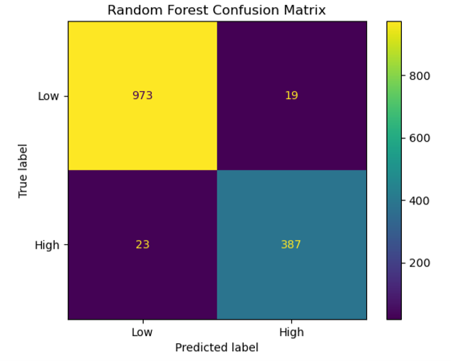
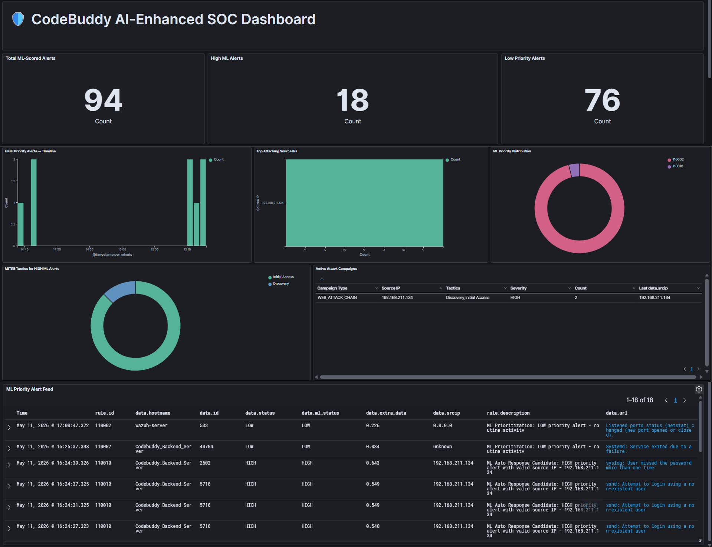

# AI-Enhanced SOC with ML-Based Threat Prioritization

**An AI-enhanced Security Operations Center for machine learning-based security alert prioritization, contextual analysis, and controlled response.**

Final Year Project

---

## Project Overview

This project designs and implements an AI-enhanced Security Operations Center for an SME environment using Wazuh and machine learning.

The system collects and monitors security alerts from multiple sources, extracts contextual security features, and uses a trained Random Forest classifier to prioritize eligible alerts as **High** or **Low priority**.

Additional components provide MITRE ATT&CK context, campaign correlation, Slack notifications, dashboard visualization, and controlled IP-based response.

---

## System Architecture


The system combines:

- **Wazuh** for centralized security monitoring
- **Suricata** for network intrusion detection
- **Auditd** for host-level monitoring
- **VirusTotal** for threat intelligence enrichment
- **Cowrie** as an SSH/Telnet honeypot
- **Random Forest** for ML-based alert prioritization
- **OpenSearch / Wazuh Dashboards** for visualization
- **Slack** for selected security notifications
- **iptables** for controlled automated response

---

## Repository Structure

```text
AI-Enhanced-SOC-ML-Threat-Prioritization/
│
├── soc_ml/
│   ├── custom_ml_priority.py
│   └── campaign_correlation.py
│
├── models/
│   ├── alert_priority_model_tuned.pkl
│   ├── feature_columns.pkl
│   └── model_threshold.pkl
│
├── notebooks/
│   └── model_training_and_evaluation.ipynb
│
├── dataset/
│   └── README.md
│
├── honeypot/
│   └── cowrie_notes.md
│
├── response/
│   ├── block_ip.sh
│   └── slack_notification.py
│
├── diagrams/
│   ├── physical_architecture.png
│   ├── logical_architecture.png
│   └── ml_pipeline_diagram.png
│
├── outputs/
│   ├── confusion_matrix.png
│   ├── roc_auc.png
│   ├── pr_auc.png
│   └── feature_importance.png
│
├── testing_evaluation/
│   ├── README.md
│   ├── wazuh_raw_alerts.png
│   └── ml_prioritized_alerts.png
│
├── figures/
│   ├── wazuh_dashboard.png
│   ├── ml_dashboard.png
│   ├── alert_prioritization.png
│   └── slack_notification.png
│
├── requirements.txt
└── README.md
```

---

## Machine Learning Pipeline


- **Model:** Random Forest Classifier
- **Input:** 21 contextual security features
- **Training:** Grouped stratified train/test workflow with GridSearchCV
- **Output:** High / Low alert priority
- **Threshold:** Probability-based operational threshold
- **Additional Context:** Model confidence and MITRE ATT&CK mapping

The model considers contextual information such as Wazuh severity, alert repetition, authentication activity, payload patterns, Suricata detections, VirusTotal enrichment, file-integrity context, service type, and other security indicators.

---

## Key Features

- ML-based High / Low alert prioritization
- 21-feature contextual alert representation
- Random Forest probability scoring
- MITRE ATT&CK tactic and technique mapping
- High-priority campaign correlation
- Controlled automated IP blocking
- Slack notification for selected important alerts
- Custom SOC dashboard for prioritized alert visualization

---

## Model Evaluation

The trained Random Forest model was evaluated using an independent test set.

Evaluation included:

- Confusion Matrix
- ROC-AUC
- Precision-Recall AUC
- Feature Importance
- Precision
- Recall
- F1-score
- Accuracy



Additional evaluation outputs are available in the `outputs/` directory.

---

## Testing and System Evaluation

A mixed attack scenario was used to evaluate the live SOC workflow under both benign and suspicious activity.

During one controlled test execution:

- The standard Wazuh dashboard recorded **166 raw alerts**.
- The ML-prioritized dashboard displayed **94 selected and prioritized alerts** after the implemented processing and filtering workflow.

The purpose of this comparison is to demonstrate how the enhanced workflow reduces the number of alerts presented for analyst review while retaining alerts that are more relevant to investigation.

### Standard Wazuh Alert View


### ML-Prioritized Alert View


These values represent the result of one controlled mixed-activity test scenario.

The exact number of generated and prioritized alerts may vary between test runs depending on factors such as:

- the attacks performed
- the number of repeated events
- benign activity occurring during the test
- alert timing
- rule firing frequency
- generated system events

Therefore, the **166-to-94 comparison should be interpreted as a representative test result rather than a fixed system output**.

More details and screenshots are available in the `testing_evaluation/` directory.

---

## Dashboard



The custom dashboard provides visibility into:

- High and Low priority alerts
- Model confidence
- Source IP information
- MITRE ATT&CK context
- Alert details
- Response information

---

## Campaign Correlation

A separate correlation component groups related High-priority alerts from the same source within a defined time window.

This provides additional analyst context for patterns such as:

- repeated High-priority alerts
- web attack chains
- brute-force activity
- multi-stage attack behavior

Implementation:

`soc_ml/campaign_correlation.py`

---

## Automated Response

The project includes controlled IP blocking using `iptables`.

Automated response is intentionally restricted to selected attack conditions rather than being triggered for every High-priority prediction.

The response logic includes:

- source IP validation
- selected rule checks
- repeated-event thresholds
- blocking
- automatic unblocking
- response logging

Implementation:

`response/block_ip.sh`

---

## Slack Notification

Selected important alerts can generate Slack notifications containing information such as:

- attack type
- final priority
- model confidence
- source IP
- agent
- original rule
- MITRE tactic
- MITRE technique
- response context

The Slack webhook credential is intentionally excluded from the repository.

Implementation:

`response/slack_notification.py`

---

## Tools & Technologies

| Category | Technology |
|---|---|
| SIEM | Wazuh |
| Machine Learning | Python, Scikit-learn, Random Forest |
| Data Processing | Pandas |
| Model Serialization | Joblib |
| Network IDS | Suricata |
| Host Monitoring | Auditd |
| Threat Intelligence | VirusTotal |
| Honeypot | Cowrie |
| Search / Visualization | OpenSearch / Wazuh Dashboards |
| Notification | Slack |
| Automated Response | iptables |
| Model Development | Jupyter Notebook |

---

## Security Notes

This repository contains a sanitized portfolio version of the project.

The following information is intentionally excluded:

- API keys
- Slack webhook credentials
- passwords
- private keys
- protected infrastructure IP addresses
- sensitive environment-specific configuration

The original project dataset is also not publicly distributed. Dataset information is documented in the `dataset/` directory.

---

## Limitations

- The system was developed and tested within a controlled virtual lab environment.
- The deployed Random Forest model is currently static and trained offline.
- Dataset size and diversity are limited compared with a production SOC.
- Automated response is intentionally restricted to selected attack scenarios.
- Live alert prioritization is performed on individual alerts rather than full temporal attack sequences.

---

## Future Improvements

- Scheduled or incremental model retraining
- Analyst-feedback integration
- Broader attack scenarios
- Stronger automated-response approval and rollback controls
- More advanced campaign investigation views
- Improved long-term log and storage management
- Additional operational datasets
